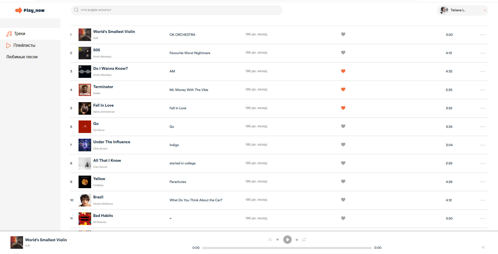

# Описание проекта

Play_now — это стриминговый сервис для меломанов. Он помогает подбирать музыку с помощью алгоритмов, хранить и прослушивать плейлисты, а также воспроизводить музыку прямо в браузере.

Проект состоит из двух частей:

Frontend — интерфейс пользователя, позволяющий взаимодействовать с сервисом.

Backend — серверная часть, предоставляющая API для работы с данными (например, плейлистами, пользователями, музыкальными треками и т.д.).

## Запуск проекта
Для того чтобы запустить проект, следуйте инструкциям в соответствующих README файлах.

[Запуск фронтенда](streaming_service/README.md)

[Запуск бэкенда](streaming_service_api/README.md)
